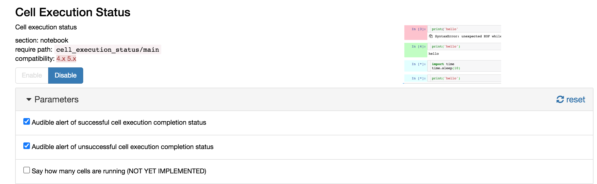

# nb\_cell\_execution\_status
Indicators relating to cell execution status


[](https://mybinder.org/v2/gh/innovationOUtside/nb_cell_execution_status/master)


Use colour to display cell execution status of notebook code cells:

- *white*: not executed
- *light cyan*: awaiting execution
- *green*: successfully executed
- *pink*: failed


Visual cell execution status indicators are based on the cell exeustion status indicators found in the  [`lc_multi_outputs`](https://github.com/NII-cloud-operation/Jupyter-multi_outputs) python package (via `NII-cloud-operation/Jupyter-multi_outputs`).

Audible feedback for successful and unsuccessful cell completion can also be enabled from the notebook extension configurator menu:



There is also an optional heartbeat pulse (default period 5s; configurable) that can be used to indicate the continuing run status of long running cells.

The [`jupyter-a11y` extension](https://github.com/ouseful-backup/jupyter-a11y/) also includes audible accessibility support eg for navigation, [kernel activity hum](https://github.com/ouseful-backup/jupyter-a11y/blob/4f5a32f4a09a8fd9e872bf179b728d01ad49b81e/nbreader/static/index.js#L92) etc.

## Install

Install via:

`pip install nb_cell_execution_status`
`pip install --upgrade git+https://github.com/innovationOUtside/nb_cell_execution_status.git`

The extension should be automatically installed and enabled.

If you need to do things manually:


```
jupyter nbextension uninstall cell_execution_status
jupyter nbextension install cell_execution_status --user
jupyter nbextension enable cell_execution_status/index
```
