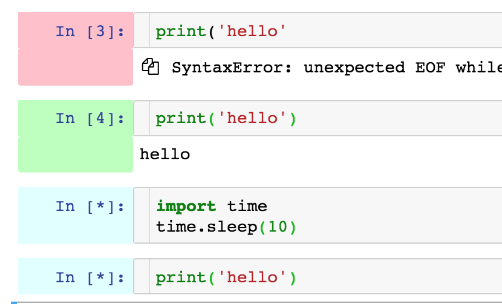

# Cell Execution Status Indicator

Visualization of each code cell's executing status with colors

## Execution status color of code cell

The prompt area of code cell displays execution status with colors.
The colors mean as follows:

- White: Not Executed
- Light cyan: Awaiting Execution
- Green: Successfully Executed
- Pink: Failed

